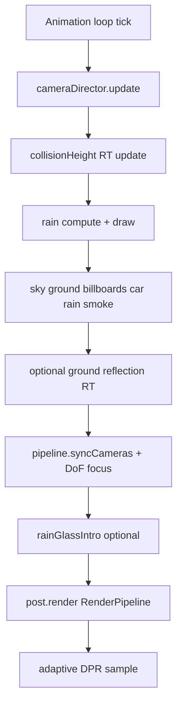

# Threejs-Punk


**Walk through a rainy cyberpunk alley** powered by **WebGPU**, **Three.js**, and **TSL** (Three Shading Language). Neon billboards, wet pavement, GPU rain that respects rooftops and props, cinematic post-processing, and first-person exploration with BVH collision.

| | |
|---|---|
| **Live demo** | [https://threejspunk.vercel.app/](https://threejspunk.vercel.app/) |
| **Authors** | [Anderson Mancini](https://andersonmancini.dev/) · **Sunag** (TSL creator) |
| **Context** | Revised for [TSL Workshop 2026](https://threejs.paris/) |
| **Stack** | Three.js `^0.185` (WebGPU + TSL), Vite 6, `three-mesh-bvh`, GSAP |

Thank you to everyone who took part in the workshop — it was an incredible experience.

---

## How to read this document

This README is a **knowledge base** for human developers. Headings are stable anchors. Every major technique names its **source file** and entry **function or class**. If anything here disagrees with the repository, **the code wins**.

**Coding agents (Cursor, Claude Code, etc.):** start with **[AGENTS.md](AGENTS.md)** — read order, hard constraints, file routing, step-by-step **technique recipes**, and a verification checklist. Deep dives: **[docs/techniques/](docs/techniques/README.md)** (collision rain, wet ground, car droplets). Cursor: [`.cursor/rules/project-context.mdc`](.cursor/rules/project-context.mdc) applies to every session; shader paths also load [`.cursor/rules/tsl-webgpu-shaders.mdc`](.cursor/rules/tsl-webgpu-shaders.mdc).

---

## Quick start

**Requirements:** a browser with **WebGPU** support and Node.js for local development.

```bash
npm install
npm run dev      # Vite dev server (HTTPS via @vitejs/plugin-basic-ssl — WebGPU needs a secure context)
npm run build
npm run preview
npm run deploy   # Vercel production
```

After the loader finishes, click **ENTER** on the intro overlay (or skip if `FEATURES.intro` is false), then **START RUN**. Settings expose look presets, audio, and (in Development Mode) the Three.js inspector.

### Neon Run: endless runner + drone shooter

With `FEATURES.runner` on (the default), the alley becomes **NEON RUN**, a first-person endless runner by ChuksOk (name and links live in `src/app/credits.js`). You auto-run down the street, switch between three lanes, jump barriers, slide under beams and dodge parked cars, while shooting down drones with a rifle.

| Action | Desktop | Touch |
|--------|---------|-------|
| Switch lane | A / D, ← / → | Swipe left half ← → |
| Jump | Space, W | Swipe left half ↑ |
| Slide | S, C, Ctrl | Swipe left half ↓ |
| Aim | Mouse (pointer lock) | Automatic (drag right half to nudge) |
| Fire | Hold left click | Hold the FIRE button (bottom-right) |
| Special attack | E / F when charged | SPECIAL button (appears beside FIRE when charged) |
| Reload | R | Automatic |
| Switch weapon | 1–4, Q, mouse wheel | Tap a weapon chip |
| Pause | Esc | — |

- **Drones:** GIGI-style drones: teal disc and white robotic-arm scouts that strafe and fire, red spider-quad gunships that charge a 3-bolt burst, and gold or blue hex bi-copter kamikazes that dive at you. Bolts can be dodged or shot down.
- **Weapons:** four VX-series guns in off-white with neon green accents: VX-06 carbine, VX-09 SMG, VX-12 rail and VX-14 heavy. Each has its own fire rate, magazine, damage, spread and recoil (`src/weapon/weaponTypes.js`), and ammo is kept per gun.
- **Special attacks:** landing shots charges a special, and you pick one per run on the start ticket. **Ally drone** deploys a small sphere drone that fights for you until it's destroyed; **Seeker** fires a heat-seeking grenade that homes in on the nearest drone and detonates (`src/weapon/createSpecials.js`).
- **Mobile HUD:** shows only score, two slim bars, target brackets, the current weapon chip, and the FIRE / SPECIAL buttons. The header and audio button hide while you play.
- **Day-night cycle:** a full day every 4 minutes of running (night → dawn → day → dusk). It drives the sun/moon light, environment light, sky gradient and clouds, and a clock on the score ticket (`src/runner/createDayNightCycle.js`; `cycleSeconds` to tune).
- **Pickups:** shards (score), shield, health, overclock (fast fire, no reloads).
- **Scoring:** difficulty and speed ramp with distance, and kills build a combo multiplier.
- **How it works:** see **[docs/techniques/endless-runner.md](docs/techniques/endless-runner.md)** (CPU-sliced city tiles, floating origin, viewmodel layer).
- **Assets:** the rifle, drones, barrier, beam and pickups are procedural PBR models built in code (`src/runner/models/`). Sounds are CC0 from Kenney's Starter Kit FPS (`public/audio/runner/CREDITS.md`).
- **UI:** the HUD and screens use a transit-ticket / utility-label style: acid lime, cobalt, paper, ink and signal pink, with Barlow Condensed and JetBrains Mono (OFL, via `@fontsource`). It lives in `src/ui/runner/runnerHud.css` plus `src/ui/core/ticketTheme.css` for the app chrome.

Set `FEATURES.runner = false` to get the original walk / orbit demo back.

---

## Architecture

The app is **not** a game engine. It is a **factory composition**: plain objects wired in [`src/main.js`](src/main.js) with an explicit lifecycle — no ECS, no monolithic scene class.

### Bootstrap and startup order

1. **Device budgets** — [`applyDevicePerformanceDefaults()`](src/platform/performanceProfile.js) and layout class ([`deviceLayout.js`](src/platform/deviceLayout.js)).
2. **Core** — camera ([`bootstrap/createCamera.js`](src/bootstrap/createCamera.js)), scene + sun ([`world/scene.js`](src/world/scene.js)), WebGPU renderer ([`bootstrap/createRenderer.js`](src/bootstrap/createRenderer.js)).
3. **World** — parallel GLTF loads, optional features ([`world/createWorld.js`](src/world/createWorld.js)).
4. **Lighting + environment** — HDR env map, intensity controller.
5. **Post** — TSL `RenderPipeline` ([`post/postprocessing.js`](src/post/postprocessing.js)) + cyberpunk look preset from localStorage.
6. **Runtime** — adaptive DPR (gated until after intro), camera director (orbit / walk), app shell, audio, intro flow.
7. **Warmup** — split shader compile ([`runtime/warmup.js`](src/runtime/warmup.js)); Safari may block the animation loop until compile completes.
8. **Loop** — [`createRenderLoop`](src/runtime/createRenderLoop.js) starts; intro runs asynchronously on top.

### One frame (simplified)



### Folder map

```
src/
├── main.js                 Application root — wires everything
├── bootstrap/              WebGPU renderer, camera
├── app/                    Loader overlay, app shell, intro flow
├── intro/                  Rain-glass intro controller
├── runtime/                Render loop, camera director, shader warmup
├── controls/               BVH first-person walk
├── world/                  Scene content: city, car, ground, weather, effects, loaders
├── clouds/                 Procedural cloud sky (TSL)
├── post/                   Full-screen TSL pipeline + cyberpunk look
├── tsl/                    Reusable TSL nodes (rain, blur, chromatic aberration, ripples)
├── platform/               DPR, device layout, performance profile, user prefs
├── ui/                     DOM chrome, walk HUD, virtual joystick
├── audio/                  Spatial engines, wet footsteps
└── debug/                  Inspector session, dev API, perf tools
```

**Assets** live under `public/` (Draco/Basis transcoder libs, compressed GLBs, textures, HDRIs, billboard videos, audio).

### Loading pipeline

Shared singleton in [`world/loaders/createGltfLoaders.js`](src/world/loaders/createGltfLoaders.js):

- **GLTFLoader** + **DRACOLoader** (`/libs/draco/`)
- **KTX2Loader** (`/libs/basis/`) with `detectSupport(renderer)` for WebGPU

City loads `cyberpunk_compressed.glb` plus an invisible bounds mesh from `colider.glb`; BVH is built in [`world/bvh.js`](src/world/bvh.js) for walk collision.

### Feature flags

Toggle features in [`src/world/features.js`](src/world/features.js). Disabled features return `null`; the render loop and post pipeline use optional chaining throughout.

To **strip the scene** for teaching or a minimal fork (which folders to ignore, recommended order), see **[STRIP.md](STRIP.md)** — do not duplicate that guide here.

### Camera and walk

[`createCameraDirector`](src/runtime/createCameraDirector.js) switches between **OrbitControls** (after intro) and **walk mode** ([`controls/createWalkControls.js`](src/controls/createWalkControls.js)). Walk uses `three-mesh-bvh` on city + collider + car meshes. Depth-of-field focus follows a GSAP-smoothed **focus point** (click-to-focus in orbit; view-ray update in walk).

---

## Why this scene stays fast

Most “AI-generated” Three.js demos stack heavy effects until the GPU chokes. This project was iterated until **look and frame time stayed in balance**. The levers are explicit in code.

| Idea | What we do | Where |
|------|------------|--------|
| **TSL node graphs** | Reusable `Fn()` subgraphs, material node slots — no hand-written GLSL strings | `src/tsl/`, materials across `world/` and `post/` |
| **GPU rain collision** | Top-down **height texture** + **compute** updates — not CPU raycasts per drop | [`createCollisionHeight.js`](src/world/weather/createCollisionHeight.js), [`createCollisionRain.js`](src/world/weather/createCollisionRain.js) |
| **Half-resolution passes** | GTAO, bloom, lens flare, ground reflection RT at reduced scale | [`performanceProfile.js`](src/platform/performanceProfile.js) |
| **Render layers** | Rain on layer 2, smoke on layer 3 — excluded from AO pre-pass where they would break normals | [`postprocessing.js`](src/post/postprocessing.js), weather/smoke modules |
| **Frame skip** | Collision height map and ground reflection need not update every frame | `collisionRainFrameSkip`, `groundReflectionFrameSkip` |
| **Distance fade** | Car surface rain intensity ramps down beyond ~20–32 m | [`applyCarSurfaceRain.js`](src/world/car/applyCarSurfaceRain.js) |
| **Split compile** | Critical path compiles city/ground/beauty first; rain/smoke/planes deferred during intro | [`warmup.js`](src/runtime/warmup.js) |
| **Device policy** | Mobile disables lens flare, billboards, GTAO; Safari caps DPR and disables adaptive DPR / DoF | [`applyDevicePerformanceDefaults`](src/platform/performanceProfile.js) |
| **Adaptive DPR** | One-way FPS-based downgrade (optional; can be disabled for consistent resolution) | [`adaptiveDpr.js`](src/platform/adaptiveDpr.js) |

### The SSR fork (historical, important)

Early versions experimented with **screen-space reflections**. Commit **`ea84fd7`** (“Version without SSR”) removed that path. Wet streets today use a **manual planar reflection** render target plus roughness-driven strength in [`createGround.js`](src/world/ground/createGround.js) — cheaper and stable inside a TSL `PassNode` graph on WebGPU (the built-in `reflector()` helper is avoided where it conflicts with pass attachments).

That trade is a large part of why the scene **feels** reflective but still runs on workshop laptops and phones.

---

## Collision rain — the height “hit” texture

This is the centerpiece technique: thousands of rain streaks and splashes that **land on roofs, the car, and the ground** without per-frame CPU raycasts.

**Deep dive (agents & porting):** [docs/techniques/collision-rain.md](docs/techniques/collision-rain.md) — diagrams, hide list, frame order, performance knobs, replication checklist. Index: [docs/techniques/README.md](docs/techniques/README.md).

### Problem

Naive rain: particles fall through geometry or require expensive ray tests against the whole city mesh each frame.

### Solution

1. **Bake a collision height map** each frame (or every N frames).
2. **Simulate drops on the GPU** with compute shaders that **sample** that map at `(worldX, worldZ)` and read **world Y** as the floor.

### Step 1 — `createCollisionHeight`

File: [`src/world/weather/createCollisionHeight.js`](src/world/weather/createCollisionHeight.js)

- Orthographic camera looks **straight down** from `cameraHeight` (default 50).
- A **moving volume** (default **100×100** world units) stays centered on the player camera.
- Render target: **512×512** half-float (`performanceProfile.collisionRainResolution`), **nearest** filtering, **no mipmaps** — sharp height texels, no blended “average” heights at edges.
- `scene.overrideMaterial` uses `MeshBasicNodeMaterial` with:

  `outputNode = vec4(positionWorld, 1)` — each texel stores the **world position** of the topmost surface in that column; rain uses the **Y** component.

- **`getUV(worldPos)`** maps world XZ into `[0,1]²` relative to the volume center (used in compute).
- **`getPosition(uv)`** maps UV back to world XZ (helper for debugging / other effects).

### Step 2 — hide false “floors”

File: [`src/world/weather/collisionHideObjects.js`](src/world/weather/collisionHideObjects.js)

During the height pass, **rain, sky, smoke, and flying planes** must not render into the RT — otherwise particles and sky would become collision surfaces. [`collectCollisionHideObjects()`](src/world/weather/collisionHideObjects.js) supplies the hide list for `collisionHeight.update({ hideObjects })`.

### Step 3 — GPU rain + splashes

File: [`src/world/weather/createCollisionRain.js`](src/world/weather/createCollisionRain.js)

- **`instancedArray`** buffers for positions, velocities, splash phases — updated via **`renderer.compute()`**.
- **Init compute**: random XZ in the rain box, Y in range, downward velocity with variance.
- **Update compute**: integrate motion; **toroidal wrap** around camera-centered volume; sample height texture; if below `floorY + epsilon`, **respawn** above (TSL `If` branches on GPU).
- **Splash compute**: atlas animation on `water-splash.webp`; Y snapped from the same height map.
- **Draw**: one instanced `PlaneGeometry` per rain and splash pass, **`billboarding()`** in `vertexNode`, streak mask in `opacityNode`.
- Rain renders on **layer 2** (`setRainLayer`); composited in the main beauty pass (`useDedicatedPass: false` — a dedicated rain pass exists in post but is unused for this implementation).

Default **5000** streak instances (`collisionRainCount`); tune in [`performanceProfile.js`](src/platform/performanceProfile.js).

### Evolution

The September 2026 **rain update** (commit `89e766f`) replaced the older streak system (`createRainStreaks.js`, removed) with this height-map + compute architecture — a large net win in correctness and scalability.

### Replication recipe (for your own project)

1. Add an ortho **top-down pass** that outputs **world position** (or at minimum world Y) into an RT with **nearest** filtering.
2. Center the ortho frustum on the camera; keep world XZ footprint modest (e.g. 100 m).
3. Each frame (or every N): render scene with override material; hide particles/sky from that pass.
4. In **compute** or a vertex shader: integrate drop positions; map XZ → UV; `floorY = texture(heightMap, uv).y`; respawn when intersecting.
5. Draw rain as **one instanced mesh** with camera-facing quads.
6. Expose **resolution**, **instance count**, and **frame skip** as central budget knobs.

---

## Wet surfaces — two different systems

Do not conflate them: **the car uses procedural droplets; the ground uses ripples + reflection.**

Deep dives: [wet ground](docs/techniques/wet-ground.md) · [car surface rain](docs/techniques/car-surface-rain.md).

### Car — procedural surface rain (TSL)

Files: [`src/tsl/surfaceRain.js`](src/tsl/surfaceRain.js), [`src/world/car/applyCarSurfaceRain.js`](src/world/car/applyCarSurfaceRain.js)

- Drop motion adapted from **[rocksdanister/rain](https://github.com/rocksdanister/rain)** (credited in source): grid hash, static beads, moving layers, trails, satellite droplets.
- **`evaluateCarSurfaceRain`**: shared uniform block; **finite-difference** normals from the drop mask (`computeCarDropNormalOffset`).
- Paint → `MeshStandardNodeMaterial`; glass → `MeshPhysicalNodeMaterial` with clearcoat-style wet read.
- **UV1** drives rain (`uv(1)`); albedo/roughness/normal maps stay on **UV0** (UVs were corrected in Blender for the Quadra model).
- Car path disables static drop layer weights (moving layers only) to avoid UV1 “blinking.”
- **Roughness** and **normal** nodes mix toward wet values by rain mask × intensity; **proximity fade** zeros rain beyond ~32 m.

### Ground — ripples + planar reflection

Files: [`src/tsl/rainRipples.js`](src/tsl/rainRipples.js), [`src/world/ground/createGround.js`](src/world/ground/createGround.js)

- **Ripples**: fixed **5×5 neighborhood** loop in TSL over world XZ — expanding ring normals, no simulation texture.
- **Wet PBR** tiles (albedo / roughness / normal).
- **Reflection**: separate **half-res** RT (`groundResolutionScale: 0.5`), optional frame skip; manual mirror camera with oblique clip plane; rain layer disabled on mirror camera.
- **Emissive** channel carries reflection × `(1 - roughness)` — wet areas pick up neon without SSR inside the post graph.

---

## Intro — rain on glass

Files: [`src/tsl/rainGlass.js`](src/tsl/rainGlass.js), [`src/intro/createRainGlassIntro.js`](src/intro/createRainGlassIntro.js)

Same **drop graph** as surface rain, applied to **aspect-corrected screen UV** with refractive offset and reduced-resolution blur before distortion. Mixed over the beauty output via an `amount` uniform during intro; **DoF and lens flare** are toned down while glass is active (the glass already blurs the image). Disposed when intro completes — see `disposeIntroRainGlass` in [`postprocessing.js`](src/post/postprocessing.js).

---

## Post-processing and look

File: [`src/post/postprocessing.js`](src/post/postprocessing.js)

Pipeline sketch:

1. **GTAO pre-pass** (normals MRT; rain/smoke layers off) → multiply AO into beauty.
2. **Scene pass** with **MRT**: color + **emissive** (drives bloom on neon billboards).
3. **Bloom** (half-res on emissive), optional **lens flare** chain.
4. **DoF** — separable box blur ([`src/tsl/boxBlur.js`](src/tsl/boxBlur.js)), mix by view-space depth vs focus point; **disabled on Safari** in rebuild path.
5. **Cyberpunk grade** — [`createCyberpunkLook`](src/post/look/cyberpunkLook.js): dual fog (geometry + sky), contrast/saturation, **edge chromatic aberration** ([`edgeChromaticAberration.js`](src/tsl/edgeChromaticAberration.js)), vignette, film grain.
6. **SMAA** (optional per profile).

**Look presets** (stored in settings): `neutral`, `neonNoir` (default), `magentaRain`, `tealDusk`, `silentHill`, `sinCity` — each tunes bloom, grade, chroma, vignette, grain via `LOOK_PRESETS` in [`cyberpunkLook.js`](src/post/look/cyberpunkLook.js).

### Sky

[`src/clouds/cloudsMaterial.js`](src/clouds/cloudsMaterial.js) — procedural 2D noise on an inward-facing sphere; pre-baked noise textures; dome follows camera XZ; sun tint from [`createCloudSky.js`](src/clouds/createCloudSky.js).

### Video billboards

[`billboardFaceShader.js`](src/world/billboards/materials/billboardFaceShader.js) — minimal TSL: video sample × radial vignette; **`emissiveNode`** feeds bloom MRT. CPU distance culling play/pause on videos saves decode cost.

### Smoke

[`createSmoke.js`](src/world/effects/createSmoke.js) — instanced sprite puffs (exhaust + ambient); layer 3 excluded from GTAO pre-pass.

### Walk collision

[`createWalkControls.js`](src/controls/createWalkControls.js) + [`bvh.js`](src/world/bvh.js) — pointer-lock movement, step handling, sprint FOV, crouch; mobile uses virtual joystick via [`createWalkInputFacade.js`](src/ui/walk/createWalkInputFacade.js).

---

## TSL patterns worth copying

Patterns used consistently across this repo — useful when prompting an agent or porting ideas:

| Pattern | Use in this project |
|---------|---------------------|
| **`Fn(() => …)()`** | Drop layers, fog, contrast, ripple loops |
| **`uniform()` + `needsUpdate`** | CPU-driven params (look, rain intensity, intro glass) |
| **`texture(rt, uv)` in compute** | Collision height sampling in rain simulation |
| **`.compute(count)` + `renderer.compute()`** | Rain and splash particle updates |
| **`billboarding({ position })`** | Instanced rain/splash quads |
| **`If(cond, () => …)` in compute** | GPU-side respawn without readback |
| **`Loop` in TSL** | Ripple neighborhood, separable blur taps |
| **Custom `TempNode`** | `EdgeChromaticAberrationNode` |
| **Material node overrides** | `colorNode`, `roughnessNode`, `normalNode`, `emissiveNode`, `opacityNode`, `vertexNode`, `outputNode` instead of ShaderMaterial strings |
| **`RenderPipeline` + `post.outputNode`** | Single graph for beauty + grade; rebuild when look/perf/intro changes |

Imports: **`three/webgpu`**, **`three/tsl`**, display nodes under **`three/addons/tsl/display/`**.

---

## How this project evolved

Short narrative from ~103 commits (July–September 2026) — not an exhaustive changelog:

1. **First cyberpunk alley** — WebGPU renderer, early post stack, cyberpunk color grade (`1c93c48`).
2. **SSR experiment, then removal** — wet look pivoted to **planar reflection + roughness** (`ea84fd7`).
3. **Interaction** — GSAP focus, BVH walk, sprint/crouch, loader polish.
4. **Rain vocabulary** — screen rain glass, ground **ripples**, inspector tuning for weather.
5. **Restructure** — `src/` split into bootstrap, world, post, runtime, platform, ui (`52b6b96`); **[STRIP.md](STRIP.md)** documents how to peel layers off.
6. **Content** — procedural cloud sky, **video billboards**, car **surface droplets** (UV1), smoke and planes with spatial audio.
7. **Performance pass** — adaptive DPR, **split shader compile**, mobile/Safari gates, separable DoF blur, ground reflection budgets.
8. **GTAO + look presets** — contact darkening and six grades in settings.
9. **Collision rain** — height texture + compute replaces streak-only rain (`89e766f`); splash atlas; hide-list for height pass.

The through-line: **every flashy effect either moved to the GPU, dropped in resolution, or was cut** when it fought WebGPU stability (SSR, full-res everything, per-drop CPU collision).

---

## Source map

| Effect | Primary file | Entry |
|--------|----------------|-------|
| App wiring | `src/main.js` | `init` |
| WebGPU renderer | `src/bootstrap/createRenderer.js` | `createRenderer` |
| World assembly | `src/world/createWorld.js` | `createWorld` |
| Collision height RT | `src/world/weather/createCollisionHeight.js` | `createCollisionHeight`, `CollisionHeight` |
| GPU rain + splashes | `src/world/weather/createCollisionRain.js` | `createCollisionRain` |
| Height pass hide list | `src/world/weather/collisionHideObjects.js` | `collectCollisionHideObjects` |
| Ground wet + reflection | `src/world/ground/createGround.js` | `createGround`, `updateReflection` |
| Ground ripples TSL | `src/tsl/rainRipples.js` | `createRainRipples` |
| Car droplets TSL | `src/tsl/surfaceRain.js` | `evaluateCarSurfaceRain`, `MovingDropLayer` |
| Car material wiring | `src/world/car/applyCarSurfaceRain.js` | `applyCarSurfaceRain` |
| Intro rain glass | `src/tsl/rainGlass.js` | `applyRainGlass` |
| Post pipeline | `src/post/postprocessing.js` | `createPostProcessing` |
| Look presets | `src/post/look/cyberpunkLook.js` | `createCyberpunkLook`, `LOOK_PRESETS` |
| Edge chromatic aberration | `src/tsl/edgeChromaticAberration.js` | `edgeChromaticAberration` |
| Separable blur (DoF) | `src/tsl/boxBlur.js` | `boxBlurSeparable` |
| Cloud sky | `src/clouds/cloudsMaterial.js` | `createCloudsMaterial` |
| Billboard video faces | `src/world/billboards/materials/billboardFaceShader.js` | `createBillboardFaceOutput` |
| Smoke | `src/world/effects/createSmoke.js` | `createSmoke` |
| Walk + BVH | `src/controls/createWalkControls.js`, `src/world/bvh.js` | `createWalkControls`, `buildModelBvh` |
| Camera modes | `src/runtime/createCameraDirector.js` | `createCameraDirector` |
| Frame loop | `src/runtime/createRenderLoop.js` | `createRenderLoop` |
| Shader warmup | `src/runtime/warmup.js` | `finalizeStartupLighting`, `compileDeferredStartup` |
| Performance knobs | `src/platform/performanceProfile.js` | `performanceProfile`, `applyDevicePerformanceDefaults` |
| Feature flags | `src/world/features.js` | `FEATURES` |
| Scene strip guide | `STRIP.md` | — |
| GLTF + Draco + KTX2 | `src/world/loaders/createGltfLoaders.js` | `getGltfLoader` |
| Runner: tiled city + wrap | `src/runner/createTrack.js`, `src/runner/sliceGeometry.js` | `createTrack`, `sliceGeometryX` |
| Runner: game loop / spawner | `src/runner/createRunnerGame.js` | `createRunnerGame` |
| Runner: lanes / jump / slide / aim | `src/controls/createRunnerControls.js` | `createRunnerControls` |
| Rifle viewmodel + hitscan | `src/weapon/createViewmodel.js`, `src/weapon/createWeapon.js` | `createViewmodel`, `createWeapon` |
| Drones + bolts | `src/enemies/createDroneManager.js`, `src/enemies/createEnemyProjectiles.js` | `createDroneManager` |
| Runner HUD | `src/ui/runner/createRunnerHud.js` | `createRunnerHud` |

---

## Development Mode

Enable **Development Mode** in settings to expose the Three.js **inspector** ([`debug/setupInspector.js`](src/debug/setupInspector.js)). Use `window.__app` (see [`createDevAppApi.js`](src/debug/createDevAppApi.js)) to A/B performance flags at runtime.

---

## License and assets

**Code** in this repository is [MIT](LICENSE) — Copyright 2026 Anderson Mancini and Sunag.

**Models, textures, audio, and videos** under `public/` are not covered by that license. Check each asset before you redistribute it. The car drop graph in `src/tsl/surfaceRain.js` is adapted from [rocksdanister/rain](https://github.com/rocksdanister/rain); keep that credit if you reuse the graph.

Workshop participants contributed to the creative direction. Technical authorship is **Anderson Mancini** and **Sunag**, as noted above.
