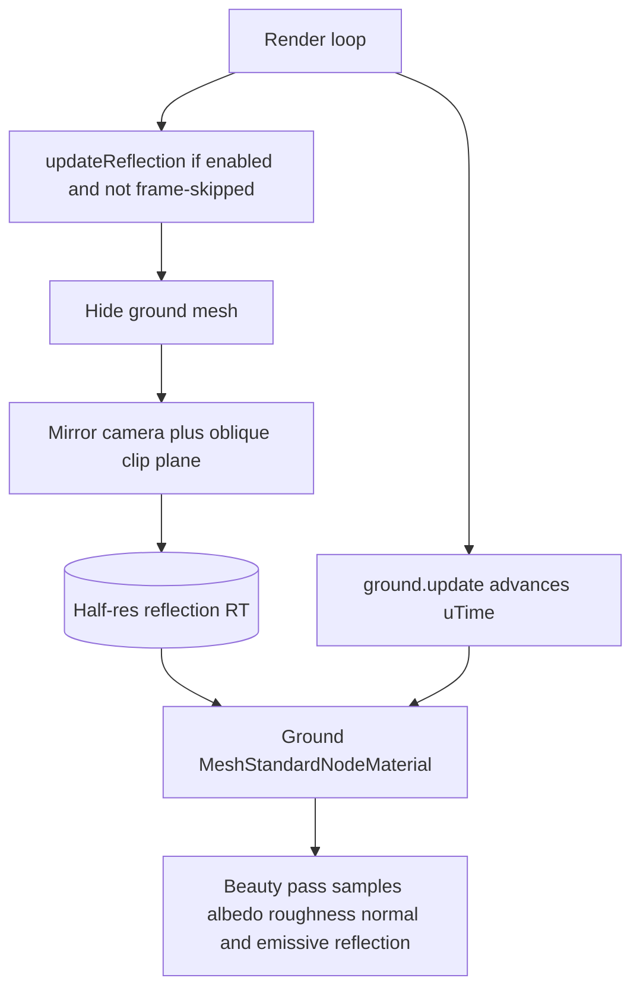

# Wet ground without screen-space reflections

How Threejs-Punk makes the alley pavement look wet: **tiled PBR**, **procedural ripple normals**, and a **manual planar reflection** render target. Screen-space reflections were removed (commit `ea84fd7`).

**Audience:** graphics programmers and coding agents porting this pattern.

**Source of truth:** [`createGround.js`](../../src/world/ground/createGround.js), [`rainRipples.js`](../../src/tsl/rainRipples.js).

This is **not** the car droplet graph. Car wetness lives in [car-surface-rain.md](./car-surface-rain.md).

---

## Why not SSR or `reflector()`

| Approach | What happened here |
|----------|--------------------|
| SSR | Tried early, then dropped. Too expensive and unstable for the workshop budget. |
| TSL `reflector()` inside a `PassNode` | On WebGPU the reflection texture can be bound as both a **sampled texture and a render attachment** in the same pass graph. The ground avoids that by rendering the mirror with a **separate** `renderer.render` into its own RT, then sampling that RT from the material. |

The file header in `createGround.js` states this constraint. Do not fold the mirror pass back into the post graph.

---

## System diagram



Call order in [`createRenderLoop.js`](../../src/runtime/createRenderLoop.js): `ground.update(delta)` (ripple time), then later `ground.updateReflection(renderer, camera)` when the performance tools allow it. Rain on or off drives `setRippleAmount(1 or 0)`.

---

## Part 1 — Ripple normals

**File:** `src/tsl/rainRipples.js`  
**Entry:** `createRainRipples({ uTime, uRippleSpeed })` → returns a TSL `Fn`.

Fixed **5×5** neighborhood (`MAX_RADIUS = 1`, `CELL_COUNT = 9`):

1. Cell origin from `floor(uv)`.
2. Per cell: hashed center, phase `fract(0.3 * time + hash)`.
3. Ring distance `d = length(v) - (MAX_RADIUS + 1) * t`.
4. Approximate the derivative of a sine ring with a central difference (`h = 0.001`).
5. Accumulate `normalize(v) * derivative`, divide by cell count.
6. Build a normal `vec3(xy, sqrt(1 - dot(xy, xy)))`.

The ground samples this with **world XZ**, not mesh UVs:

```javascript
const rippleSample = getRipples(positionWorld.xz.mul(uRippleScale));
```

World-space UVs keep rings stable on a huge plane and avoid seams at texture repeats.

Two uses of `rippleSample.xy`:

| Uniform | Role |
|---------|------|
| `uRippleNormalStrength` (default 0.015) | Added into the tiled normal map before `normalNode` |
| `uRippleStrength` (default 0.08) | Added into the reflection UV so puddles distort the mirror |

`uRippleAmount` is 1 while rain is enabled and 0 when it is not.

---

## Part 2 — Tiled wet PBR

Textures (repeat wrap):

- `/textures/wet-puddles-albedo.jpg`
- `/textures/wet-puddles-roughness.jpg`
- `/textures/wet-puddles-normal.jpg`

Shared UV: `uv().mul(uUvRepeat)` (default repeat ~14.9).

- `roughnessNode = roughness.r * uRoughnessScale` (default scale 0.55).
- `metalness = 0`.
- `colorNode` is albedo RGB with alpha from `rangeFogFactor` so the plane fades with distance.
- Plane: 400×400, rotated flat, `y ≈ -5.4`, `receiveShadow`.

---

## Part 3 — Planar reflection

`updateReflection(renderer, camera)`:

1. Respect `uReflectionEnabled` and `groundReflectionFrameSkip`.
2. Resize the RT to `drawingBufferSize * groundResolutionScale` (default **0.5**), half-float, linear filter, no mipmaps.
3. Build a mirror camera: reflect view position and look target across the ground plane, copy FOV/aspect/near/far, match `coordinateSystem`.
4. **Disable `RAIN_LAYER`** on the mirror camera so streaks are not reflected as solid geometry.
5. Oblique clip plane (Lengyel-style projection tweak) so geometry below the ground is clipped. WebGPU uses a slightly different `projectionMatrix.elements[10]` write than WebGL — the code branches on `renderer.coordinateSystem`.
6. Hide the ground mesh, clear MRT, `renderer.render(scene, mirrorCamera)` into the RT, restore target and visibility.

The material does **not** use the reflection as `envMap`. It writes it to **emissive**:

```javascript
const wetness = roughness.oneMinus();
return reflectionTex.rgb.mul(wetness).mul(uReflectionStrength).mul(uReflectionEnabled);
```

Smoother (lower roughness) texels reflect more. `uReflectionStrength` defaults to **0.08** — a hint of neon, not a chrome floor. Reflection UVs are `screenUV` flipped on X, plus normal-map warp and ripple offset.

---

## Performance knobs

From [`performanceProfile.js`](../../src/platform/performanceProfile.js):

| Key | Default | Effect |
|-----|---------|--------|
| `groundReflection` | true | Master toggle (also `setReflectionEnabled`) |
| `groundResolutionScale` | 0.5 | Mirror RT resolution |
| `groundReflectionFrameSkip` | 1 | Skip mirror renders |

Ripple cost is a **fixed** TSL loop per ground pixel (25 cells). It does not grow with rain drop count.

---

## Replication checklist

- [ ] Tile albedo, roughness, and normal on one UV.
- [ ] Add a world-XZ ripple `Fn` and mix its XY into `normalNode`.
- [ ] Allocate a half-res RT. Render a mirror camera into it **outside** the post `PassNode`.
- [ ] Clip with an oblique plane. Hide the reflector mesh during that render.
- [ ] Sample the RT in `emissiveNode`, scaled by `(1 - roughness)`.
- [ ] Optionally warp the sample UV with normals and ripples.
- [ ] Expose resolution scale and frame skip.

---

## Related docs

- [README — Wet surfaces](../../README.md#wet-surfaces--two-different-systems)
- [AGENTS.md — Recipe C](../../AGENTS.md)
- [Collision rain](./collision-rain.md) (streaks that land on this ground)
- [Car surface rain](./car-surface-rain.md)
